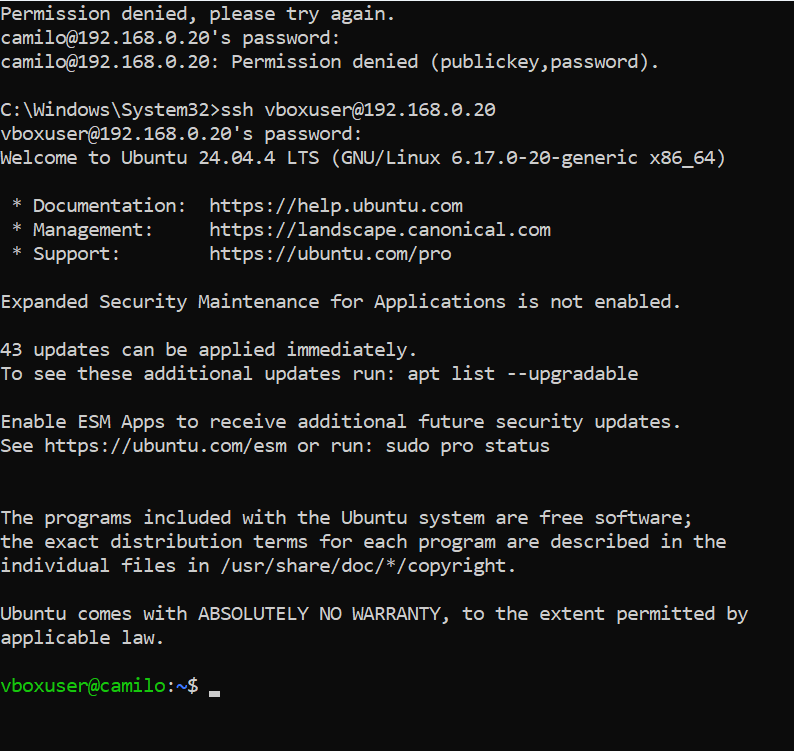
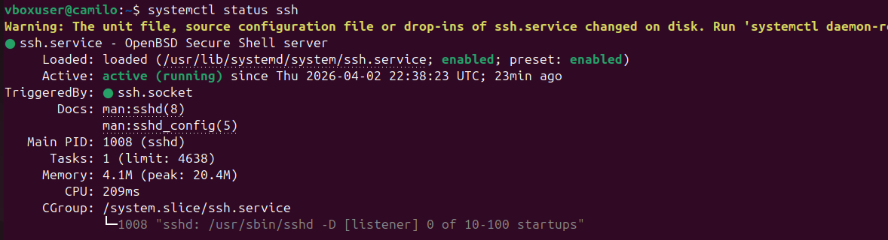
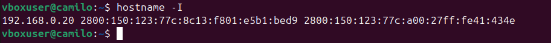

# linux-server-segurity
implementacion de un servidor linux seguro en una maquina virtual, configurando acceso remoto medianto SSH y aplicando medidas basicas de seguridad.
##  Evidencia

###  Conexión SSH

###  Estado del servicio

###  Dirección IP

